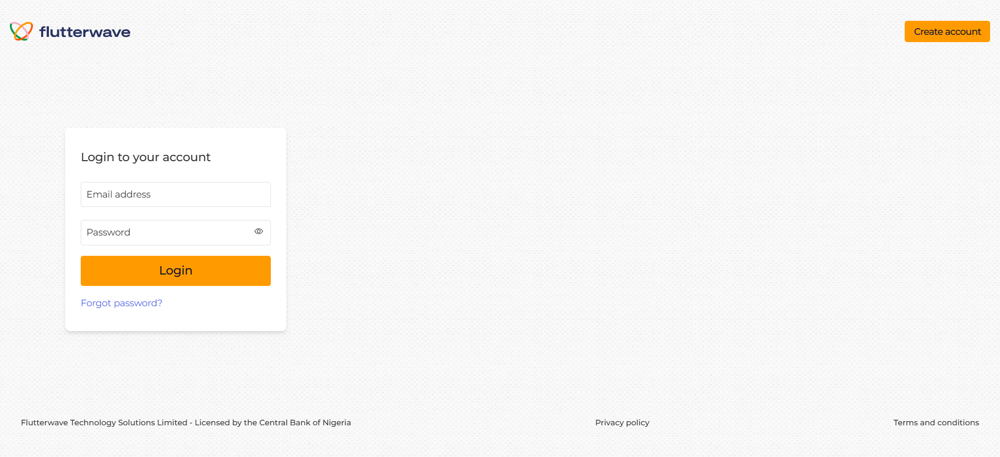

# Flutterwave Clone 💰💼📈

### <i> A responsive payment dashboard for a Flutterwave-like payment gateway.</i>

## Screenshots

#### Register

#### Login Page



#### Dashboard

## Table of Contents

- [About](#about)
- [Key Features](#key-features)
- [Tools](#tools)
- [Getting Started](#getting-started)
- [Usage](#usage)
- [Contributing](#contributing)
- [License](#license)
- [Contact](#contact)

## About ✍️

This dashboard will allow businesses to manage their transactions, view insights, and interact with key payment data.

## Key Features 🌠

Here’s what makes Flutterwave Clone stand out:

- 📈 **Dashboard Overview Page**:

  1.  Display total transactions, total revenue, and a summary of successful, failed, and pending transactions.
  2.  Include visual charts (bar chart or pie chart) for transaction insights

- 💲 **Transaction Table**:

  1. Display a paginated table with transaction details
  2. Include sorting and filtering functionalities (e.g., by status or date)
  3. Add a search bar to search for transactions by Customer Name or Transaction ID

- 🌐 **Responsive Design**
  Ensure the dashboard works seamlessly on both mobile and desktop screens

## Tools

- **Frontend Frameworks:** Reactjs
- **CSS Frameworks:** Tailwind CSS,
- **Chart Libraries:** Chart.js, Recharts, ApexCharts
- **Version Control:** GitHub for sharing your project repository
- **Deployment:** Vercel

## Getting Started

### Prerequisites

- Node.js (version 14 or higher)
- npm (Node Package Manager)

### Installation

- 1.  Clone the repository

```bash
git clone https://github.com/motuncoded/flutterwave-clone

```

- 2.  Navigate to the project directory

```bash
cd flutterwave
```

- 3. Install dependencies

```bash
npm install
```

- 4.  Start the development server

```bash
npm start

```

## Usage

Open your browser and go to http://localhost:3000 to access the dashboard.

## Contribution

## Contributing

Contributions are welcome! Please follow these steps:

1. Fork the repository.
2. Create a new branch (`git checkout -b feature-branch`).
3. Make your changes and commit them (`git commit -m 'Add new feature'`).
4. Push to the branch (`git push origin feature-branch`).
5. Open a pull request.

## License

This project is licensed under the MIT License - see the [LICENSE](LICENSE) file for details.

## Contact

For inquiries, feel free to reach out:

- [Email](mailto:motunrayoadeneye@gmail.com)
- [GitHub Profile](https://github.com/motuncoded)
